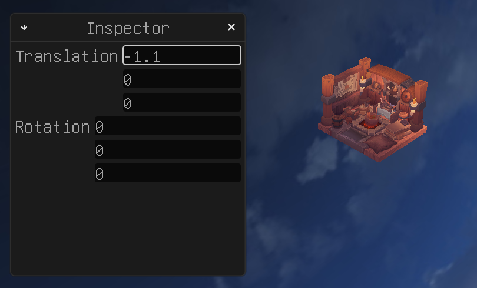
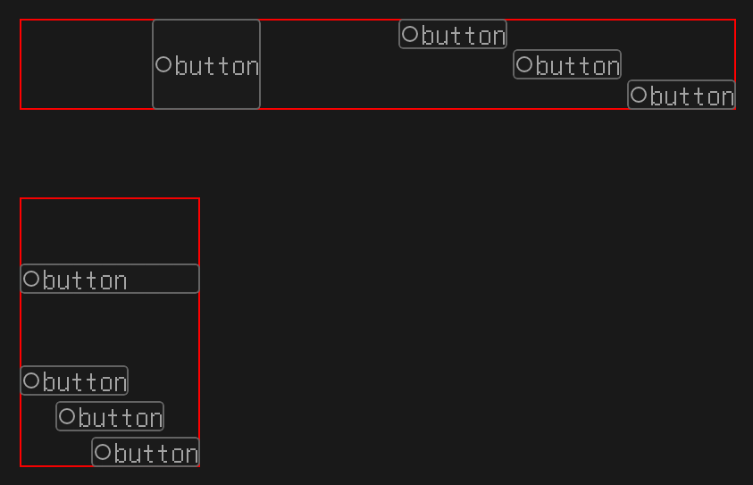
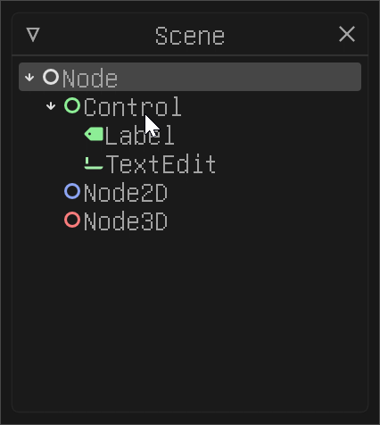

# Flint

  

Flint is a vector-based Vulkan GUI framework in development.

Features:

* Scene tree.
* Vulkan backend.
* High quality anti-aliasing.
* Multiple window support.
* Cross-platform.
* I18N support.

The development work has been mostly done on Windows, but it should be easy to make
it run on other platforms.

## How to run examples

### Shader generation

* Run `src/shaders/compile.ps1` to generate shader headers. You should have Vulkan SDK installed first.
