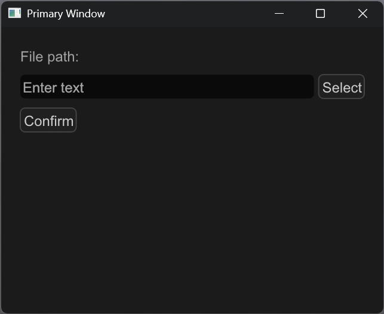
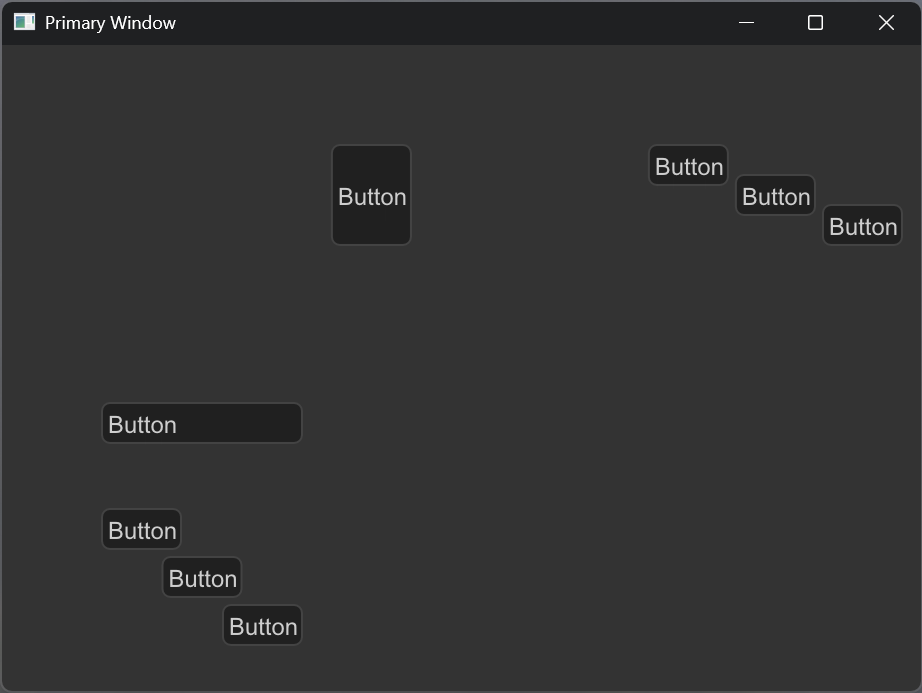

# flint_gui

This is an experimental vector-based GUI framework.

**Warning: this is not intended for production use and never will be.**

Features:

* Node-based scene management
* Vulkan/OpenGL backend
* High quality antialiasing
* Multiple window support
* Cross-platform (Windows, Linux, macOS)
* I18n support

The development work has been mostly done on Windows, but it should be easy to make
it run on other platforms.

## How to run examples

### Shader generation

* Run `src/shaders/compile.ps1` to generate shader headers. You should have Vulkan SDK installed first.
